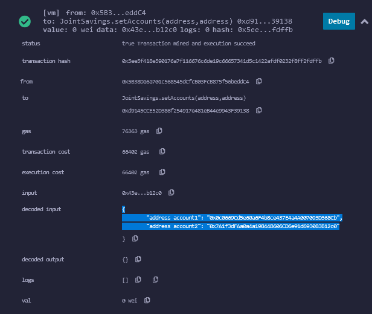

# Module 20 Challenge

1. Use the `setAccounts` function to define the authorized Ethereum address that will be able to withdraw funds from your contract.

   > ```text
   > Dummy account1 address: 0x0c0669Cd5e60a6F4b8ce437E4a4A007093D368Cb
   > Dummy account2 address: 0x7A1f3dFAa0a4a19844B606CD6e91d693083B12c0
   > ```

   

2. Test the deposit functionality. After each transaction, use the `contractBalance` function to verify that the funds were added to your contract:

   - Transaction 1: Send 1 ether as wei.
     
   - Transaction 2: Send 10 ether as wei.
     
   - Transaction 3: Send 5 ether.
     

3. Test the withdrawal functionality:

   - withdrawing 5 ether into `accountOne`.
     
   - withdrawing 10 ether into `accountTwo`.
     

After each transaction, use the `contractBalance` function to verify that the funds were withdrawn from your contract. Also, use the `lastToWithdraw` and `lastWithdrawAmount` functions to verify that the address and amount were correct.
